

V této práci sestavím ideální počítač pro práci s grafikou. Rozpočet není omezen, ale nebudu používat nejdražší serverové komponenty, jako jsou AMD EPYC nebo NVIDIA H100. Půjde o výkonnou domácí sestavu, která si poradí s většinou úloh souvisejících s grafikou, 3D modelováním a střihem videa.

---

## Intel Core Ultra 9 285K 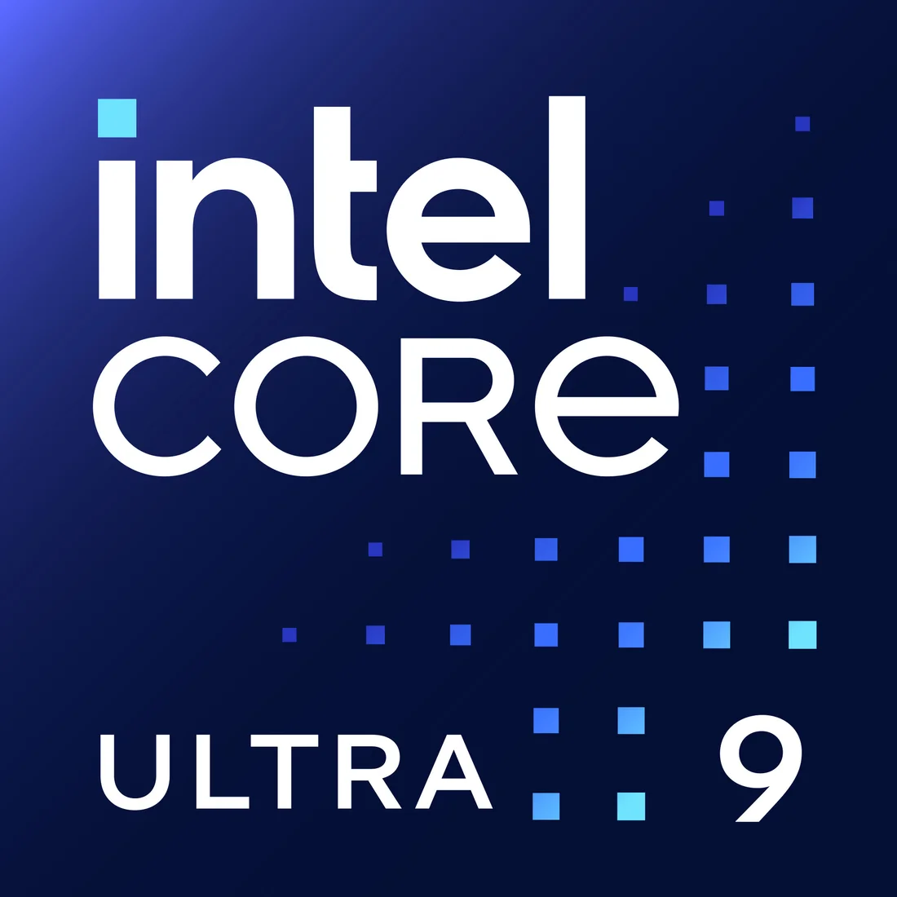
  - 24 jader (8P + 16E)
  - 67 820 bodů v Passmark
  - Maximální frekvence 5.6 GHz

💾 Typ komponentu: **Processor**  
🏷️ Cena: **~15 000 Kč**  
🌐 [Heureka](https://procesory.heureka.cz/intel-core-ultra-9-285k-bx80768285k/#prehled), [Alza.cz](https://www.alza.cz/intel-core-ultra-9-285k-d12601692.htm)

---

## ASUS TUF GAMING Z890-PLUS WIFI 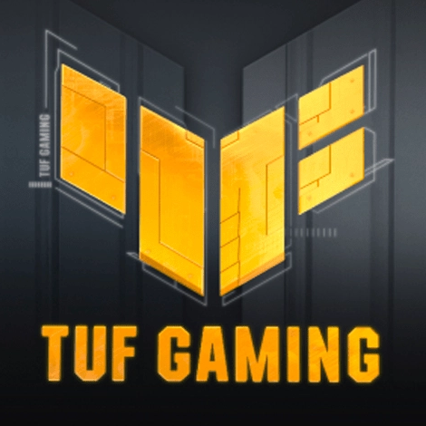
  - Kvalitní provedení s chladiči
  - Čipset Intel Z890, socket 1851
  - Podpora 4 modulů operační paměti DDR5
  - Moderní standardy PCIe, USB, WiFi atd.

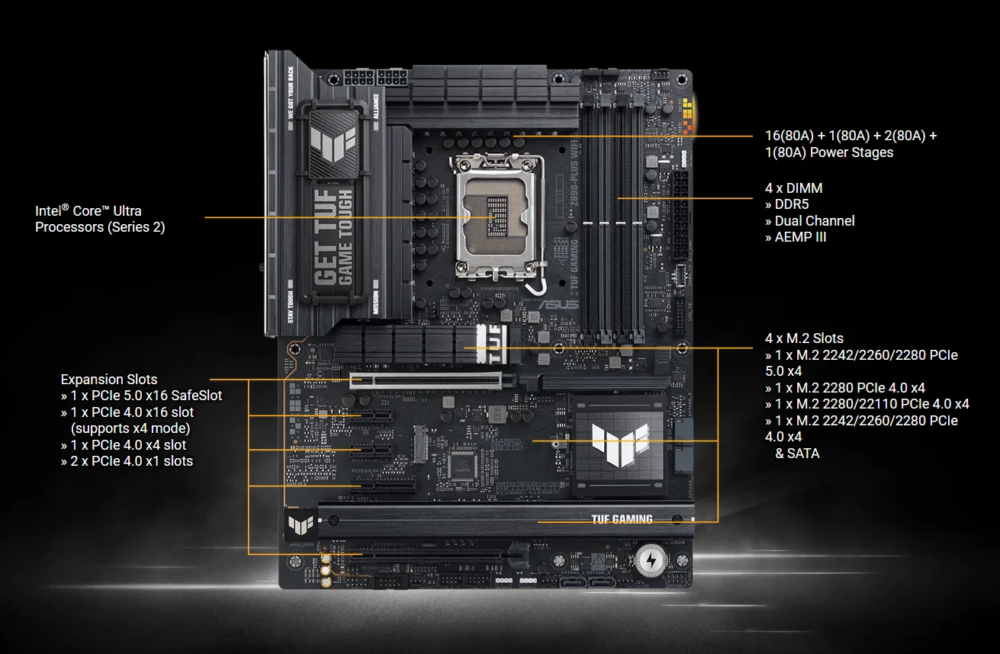

💾 Typ komponentu: **Základní desky**  
🏷️ Cena: **~8 000 Kč**  
🌐 [Heureka](https://zakladni-desky.heureka.cz/asus-tuf-gaming-z890-plus-wifi-90mb1iq0-m0eay0/#prehled/), [Alza.cz](https://www.alza.cz/asus-tuf-gaming-z890-plus-wifi-d12623505.htm)

---

## Kingston FURY Renegade 96GB DDR5 
  - Frekvence 6400 MHz
  - Časování CL32
  - Propustnost 51 200 MB/s

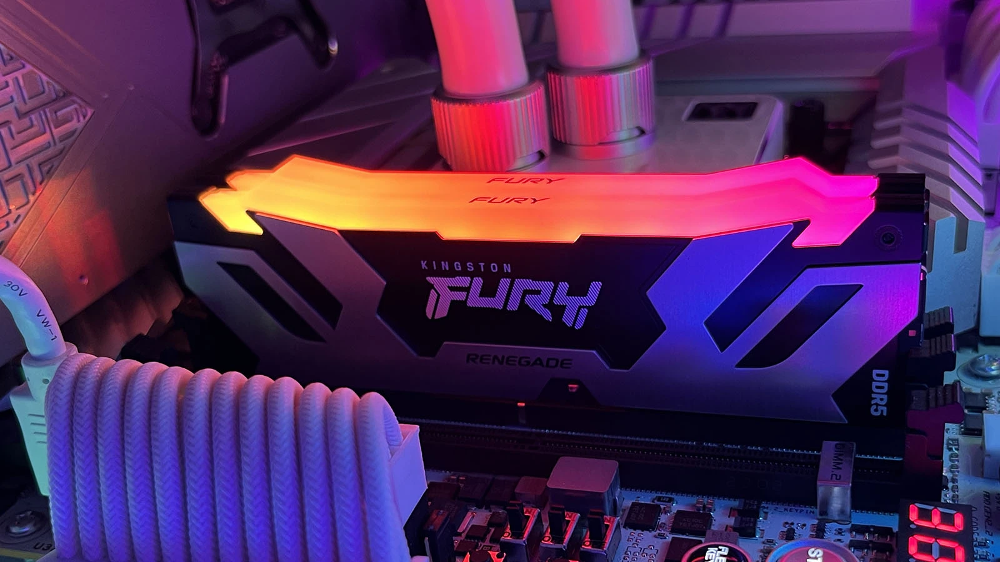

💾 Typ komponentu: **Operační paměť**  
🏷️ Cena: **~11 000 Kč**  
🌐 [Heureka](https://pameti.heureka.cz/kingston-fury-renegade-ddr5-96gb-6000mhz-cl32-2x48gb-kf560c32rsk2-96/#prehled/), [Alza.cz](https://www.alza.cz/kingston-fury-96gb-kit-6000mt-s-ddr5-cl32-renegade-silver-xmp-d10868162.htm)

---

## ASUS TUF GeForce RTX 5090 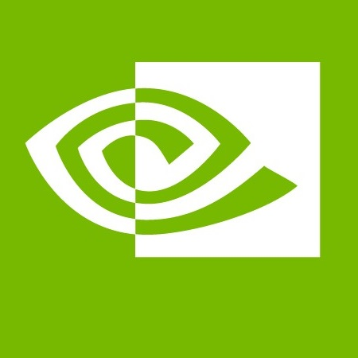
  - 32 GB paměti GDDR7
  - 39 850 bodů v Passmark
  - Výkon 104.8 TFLOPS při výpočtech v režimu FP16

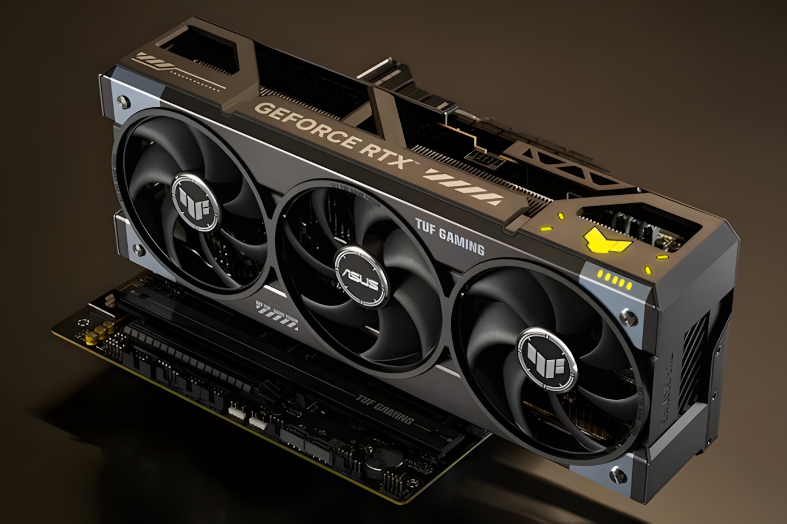

💾 Typ komponentu: **Grafická karta**  
🏷️ Cena: **~73 000 Kč**  
🌐 [Heureka](https://graficke-karty.heureka.cz/asus-tuf-gaming-geforce-rtx-5090-32gb-gddr7-90yv0ly1-m0na00/#prehled/), [Alza.cz](https://www.alza.cz/asus-tuf-geforce-rtx-5090-32g-gaming-d12783432.htm)

---

## Samsung 990 PRO 2TB 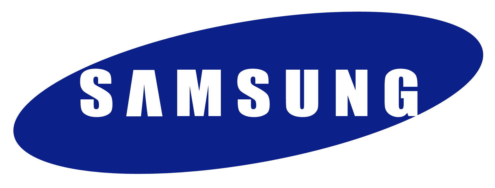
  - Rychlost čtení 7450MB/s
  - Rychlost zápisu 6900MB/s
  - Životnost 1200TBW
*(pro systém a aplikace)*

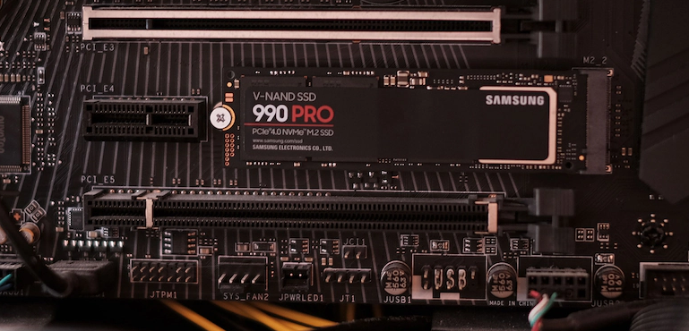

## Kingston FURY Renegade 4TB 
  - Rychlost čtení 7300MB/s
  - Rychlost zápisu 7000MB/s
  - Životnost 4000TBW
*(pro pracovní data a projekty)*

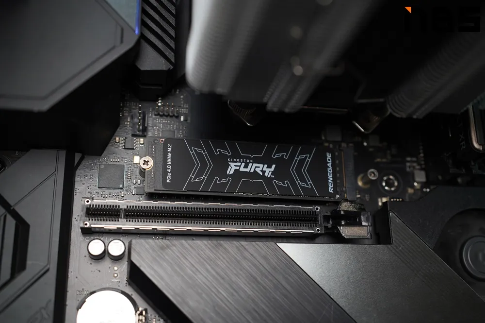

💾 Typ komponentu: **SSD disk M.2**  
🏷️ Cena: **~11 800 Kč** *(4 500 + 7 300)*  
🌐 [Heureka](https://pevne-disky.heureka.cz/samsung-990-pro-2tb-mz-v9p2t0bw/#prehled/), [Alza.cz](https://www.alza.cz/samsung-990-pro-2tb-d7516910.htm) *(Samsung)*  
🌐 [Heureka](https://pevne-disky.heureka.cz/kingston-fury-renegade-4tb-sfyrd-4000g/#prehled/), [Alza.cz](https://www.alza.cz/kingston-fury-renegade-nvme-4tb-d6817203.htm) *(Kingston)*

---

## be quiet! Dark Power Pro 13 1600W 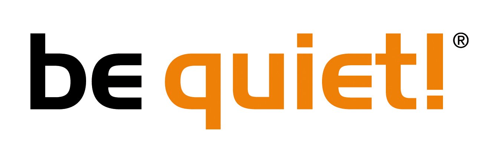
  - Certifikace 80 PLUS Titanium
  - Odpojitelné kabely
  - Maximální hlučnost 23 dB

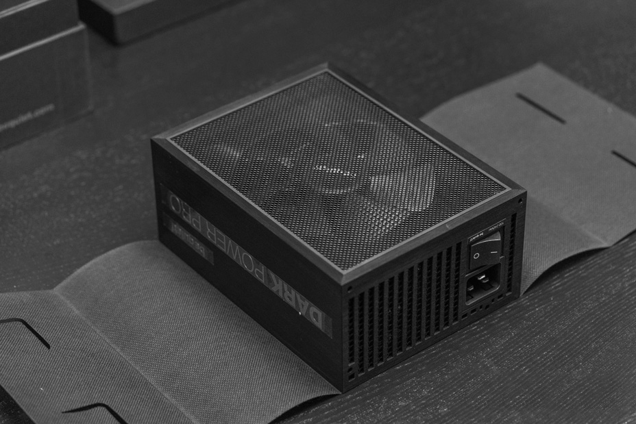

💾 Typ komponentu: **Zdroj**  
🏷️ Cena: **~12 000 Kč**  
🌐 [Heureka](https://zdroje.heureka.cz/be-quiet-dark-power-pro-13-1600w-bn332/#prehled/)

---

## ARCTIC Liquid Freezer III 360 Pro 
  - Schopen ochladit Ultra 9 285K na 70 stupňů
  - Maximální hlučnost 22,5 dB
  - Výborná kvalita

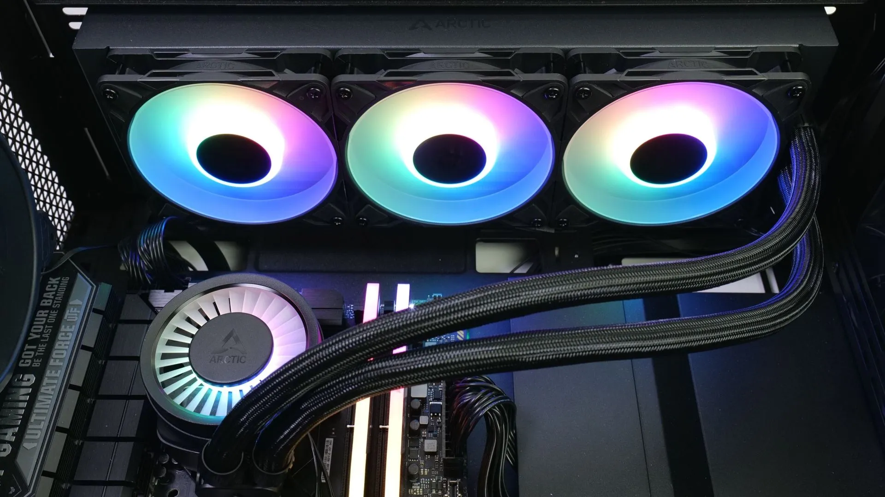

💾 Typ komponentu: **Vodní chlazení**  
🏷️ Cena: **~2 700 Kč**  
🌐 [Heureka](https://chlazeni.heureka.cz/arctic-liquid-freezer-iii-pro-360-acfre00180a_2/#prehled/), [Alza.cz](https://www.alza.cz/arctic-liquid-freezer-iii-360-pro-black-levne-d12920035.htm)

---

## Lian Li O11 Dynamic EVO RGB 
  - Tvrzené boční a přední sklo
  - Prostorný a krásný design

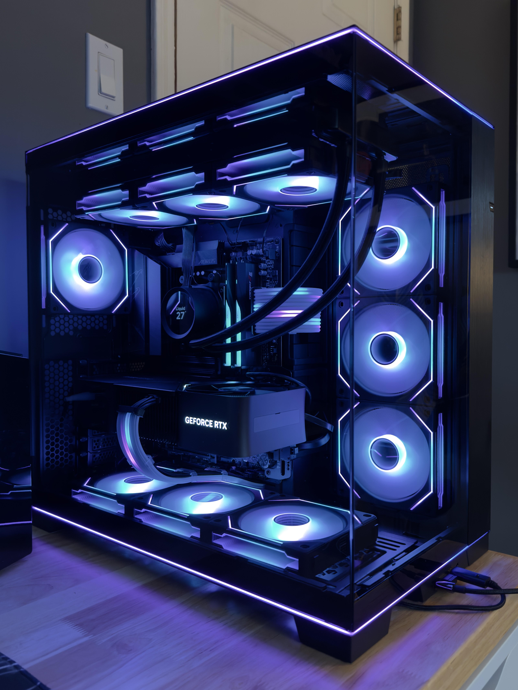

💾 Typ komponentu: **PC skříň**  
🏷️ Cena: **~4 100 Kč**  
🌐 [Heureka](https://pc-skrine.heureka.cz/lian-li-o11-dynamic-evo-rgb-tempered-glass-black/#prehled/)

---

💰 Celková cena sestavy: **~137 600 Kč**.

Tato konfigurace je ideální pro:  
- 🎬 Střih videa a color grading v DaVinci Resolve, After Effects  
- 🎨 3D modelování a rendering v Blenderu, Cinema 4D, Maya  
- 🧠 Úlohy AI/ML, práci s neuronovými sítěmi a modely umělé inteligence  
- 📐 Projektování v AutoCADu, Revitu, SolidWorks  
- 🕹️ Hraní her na ultra nastavení ve 4K a VR

🔥 Vyvážená kombinace špičkového procesoru, 96 GB operační paměti, RTX 5090 a rychlých NVMe SSD zajišťuje nekompromisní výkon. Sestava zároveň nabízí skvělé chlazení, spolehlivé napájení a estetickou skříň s RGB – ideální nejen výkonem, ale i vzhledem.